# Kottans frontend course working diary

## Greating

Hi. My name is Eugene. I am interested in web development.
Nowdays I am learning JavaScript, React JS, HTML and CSS.
Also I learn python and SQL for Backend purposes.
And little bit of PHP.
When I read news about opening [Kottans frontend course](https://github.com/kottans/frontend), I wanted to participate this challenge.
And even if I will not go on Stage 1, I will try to finish full course and get new knowledge about web development.

--

## Git Basics

I knew certain basic things about git before. But only now I realized that I knew almost nothing about this instrument. Branching, as well as remote work mechanisms, allow you to work on the project safely and conveniently. And not necessarily even as a team, even when you are the only developer of the project, branching allows you to avoid many problems.

---

- The new things I've covered in detail are branching and collaborating. These are truly powerful tools that unlock the power of git.

- I was surprised that git is based on fairly simple principles, it is a completely open tool, on the one hand simple, but on the other hand very powerful and fast, one of the most important tools for modern software development

- Until recently, I tried to use git several times. But since I did not fully understand the principle of its use, the interaction did not continue beyond the first steps. Now I want to try to use branching in my projects when developing new functions in own projects. The most important thing is practice to get used to the commands and the logic of building the commit tree. I even write this part of the file in a separate branch, so that later I can merge it into the main branch.

---

### Useful links about git

[Learn Git Branching](https://learngitbranching.js.org/)
I found this link on Kottans course. This is a useful resource for understanding complex git concepts. It seems to me that in real projects such complex branching is unlikely to occur :)

[Git HowTo](https://githowto.com/)
A good tutorial that shows all the basic concepts of Git step by step on a small project. I like this site.

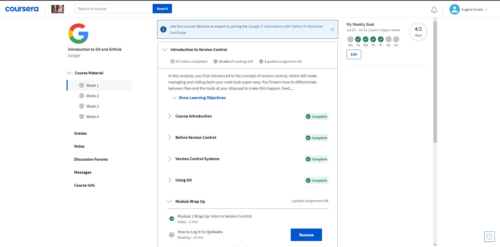
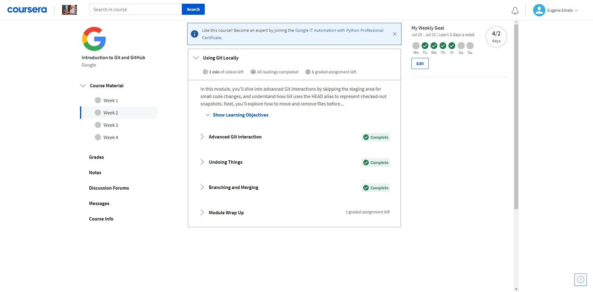
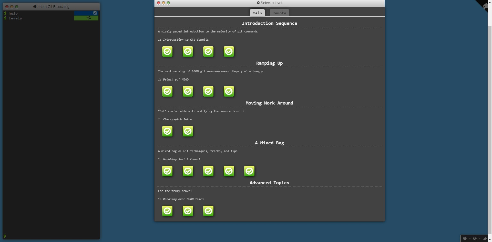
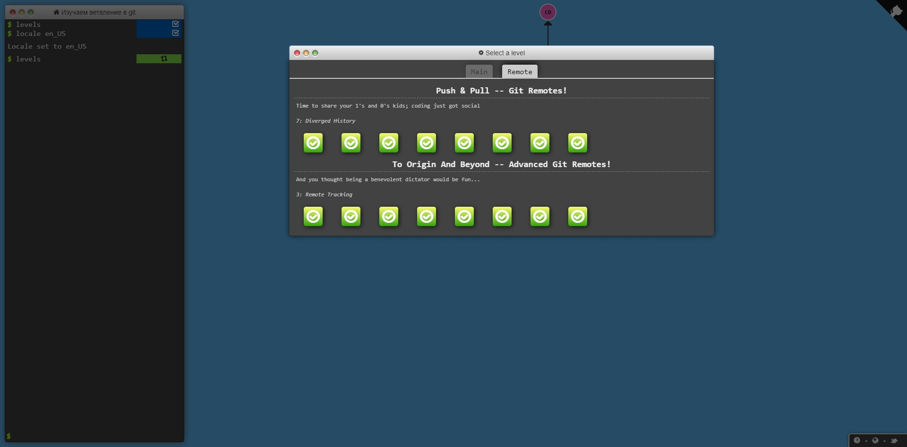

---

## Linux CLI, and HTTP

### Linux CLI

I've been working on Linux for a while, it's necessary for my job of setting up the server and sites. Most of the basic commands for working with the file system, user rights, system configuration, reading logs are known to me. If something is not clear or not known, I find information on the Internet.

For some time now, I began to understand the full power of the Linux command line and its importance in developing, debugging, and configuring a server.

Now I am learning vim. Although it is difficult to learn, it is nevertheless a very powerful editor that does not require a graphical interface to work, it is enough tto connect to the server via SSH and the command line for edit any text file.

After learning about Linux command line commands, I learned a few useful features that I didn't know about before. For example, you can manage file permissions using abbreviations like chmod o+r. I used to struggle with number combinations like chmod 0755. Now I'm also learning the power of the grep command to find information in files, such as server logs. Very comfortably.

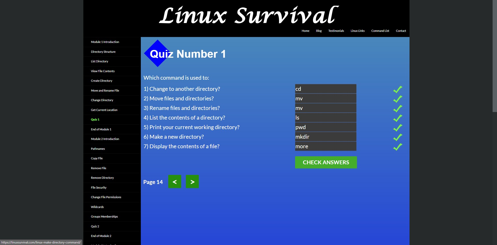
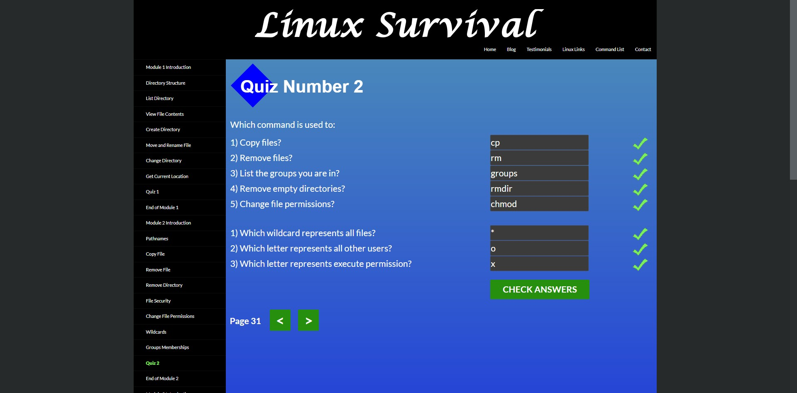
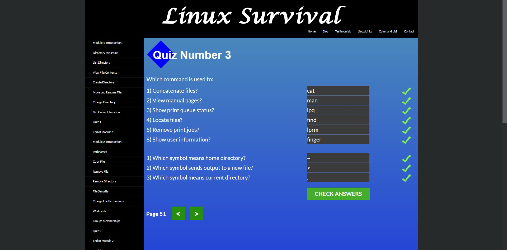
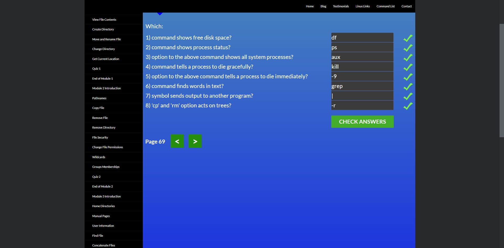

---

### HTTP

A very interesting topic for me.

As you study various technologies for developing WEB applications, you have to constantly come across HTTP. And this topic is not easy and a little confusing at first glance. 

I already knew about the basic server response codes, request and response headers. I liked the article because it covers different aspects of the HTTP protocol from beginning After reading it, all the knowledge that was already there was consolidated and expanded.

What was new is information about the structure of the HTTP request and response, the structure and sequence of the header, body, used delimiter. In fact, the request and response is just plain text. More interesting was the information about the different types of requests. I know some about GET and POST, I have to work with them when create little projects. Heard about PUT, DELETE, worked with them a little. And it was interesting to read about the rarely used HEAD, OPTIONS, TRACE. I was surprised to learn that HTTP is a very versatile protocol, you may set your own headers, the main thing is that the receive side understand them.

I learned that the protocol is able to maintain a connection after a file transfer.

A topic that I did not fully know, but which is very important - authentication. The article explains it well.

Caching, how HTTPS works and SSL certificates - just to name a few.

I just reviewed the article again and realized that it needs to be read at least once again, there is a lot of useful information.

In the future, it is necessary to consolidate the information received in practice, this helps to remember the material. Now I use Chrome and Firefox debug tools, a python and javascript debugger, as well as special sites like [httpbin](https://httpbin.org/) to analyze requests and responses. I want to learn the traffic analysis tools - Fiddler.

I want to take a closer look at authentication, in particular, with its implementation in various frameworks and libraries (Django, Express JS etc), since I didn’t have to use it in close before.

### Useful Links

Need to reed again

[HTTP Proptocol part 1(ukrainian)](https://code.tutsplus.com/uk/tutorials/http-the-protocol-every-web-developer-must-know-part-1--net-31177)
[HTTP Proptocol part 2(ukrainian)](https://code.tutsplus.com/uk/tutorials/http-the-protocol-every-web-developer-must-know-part-2--net-31155)

[httpbin](https://httpbin.org/)

---

## Git Collaboration

I have little experience with git and at the moment, and it's limited to working with local repositories and pushing to a remote repository.
After going through the lessons on Collaboration, Code Review and Continuous Integration, I realized that I had mastered only a small part of the available git and github features for developing applications.

For me were new and interesting the principles of creating a pull request and the general principles of collaborating on a project, when various developers make their changes and send them to the team of core developers for approval.

Also in the future, it is necessary to learn the principles of Code Review in more detail, this helps not only to make the code better, but also allows use and implement best practices in my own code, also it is allow do not make mistakes.

The lessons on Continuous Integration/Continous Delivery tools were interesting to me, because these are modern software development techniques that used in many software companies, knowledge and understanding of these techniques is very important when working on a large project.

What I understand At this stage - The topics of these lessons are quite complex, I need to read additional articles, and it is also very important to get practical experience in applying them, so I want to try to participate in a project that fully uses the tools of git and github for collaborative development.

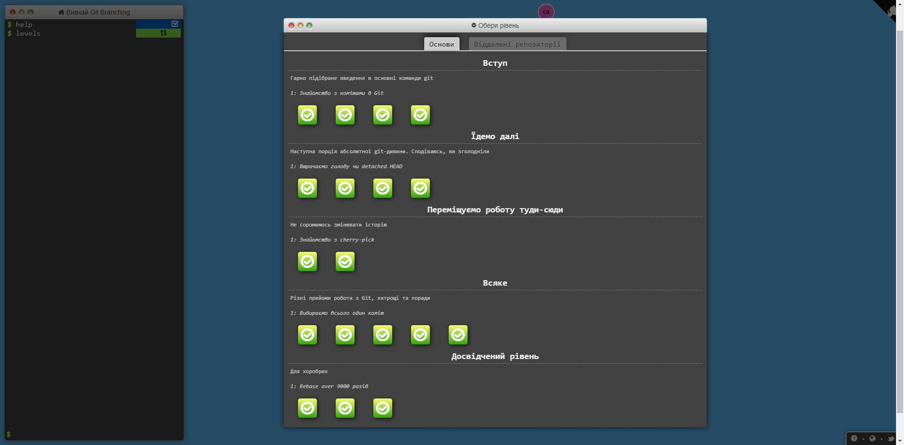
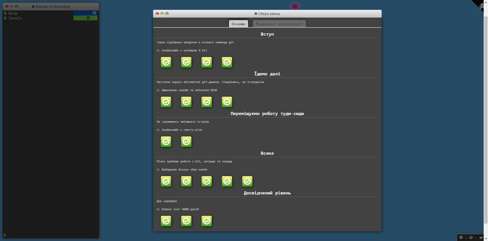
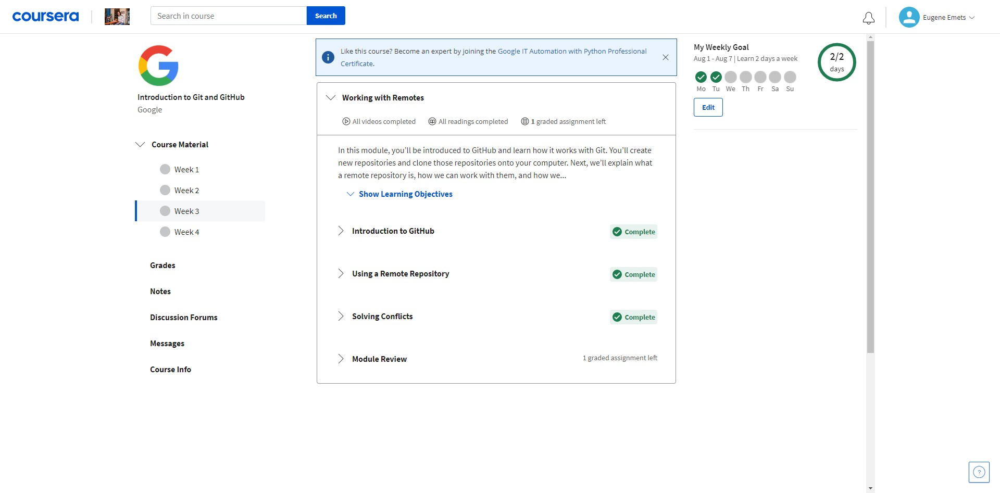
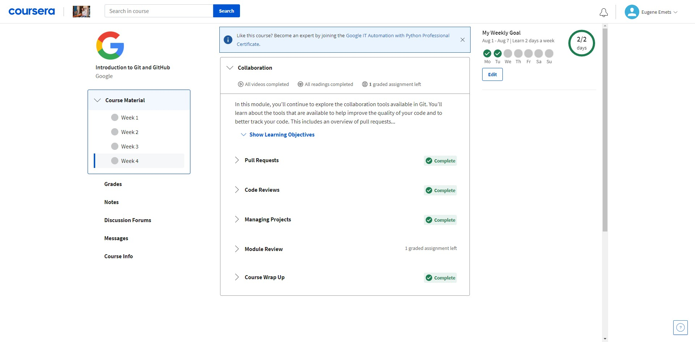

---

## HTML and CSS Intro

HTML and CSS are the foundation of web development. And at first glance, the topic is not complicated. But the application requires taking into account many nuances and continuous practice.

After listening to the lessons, I learned more about semantic tags. Until now, I have heard about them, but in practice, it was not necessary to apply. This all applies to HTML5, but I mostly studied the HTML4 standard. I read additional articles on MDN to understand all aspects of the application of new tags.

Also, I learn new tags for embedding media elements on the page - video, audio, picture

Studied in detail the tags for table formatting like thead, tfoot

An extensive topic is forms. I tried to figure out the uses of the label tag, and the states of the input tag.

Separately, I focused on modern layout methods - flexbox and especially grid, now it is possible to layout adaptive pages easily and quickly.

Also, box-model is interesting, how the dimensions of each element are calculated. Recently, there have also been options for working with fonts in CSS, and studied how they can be downloaded from a CDN, and not just locally. This provides new opportunities for the introduction of their fonts when laying out the page.

For now, HTML and CSS have many new features, you can study them for years and learn new things all the time. Shortly I want to practice learning layout, semantic tags, and adaptive layout. This knowledge is one of the most important for a web developer.

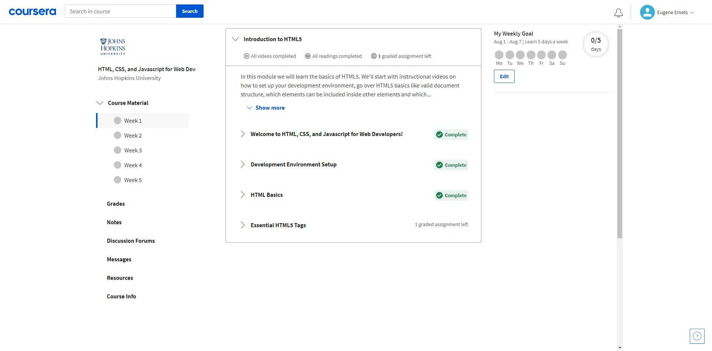
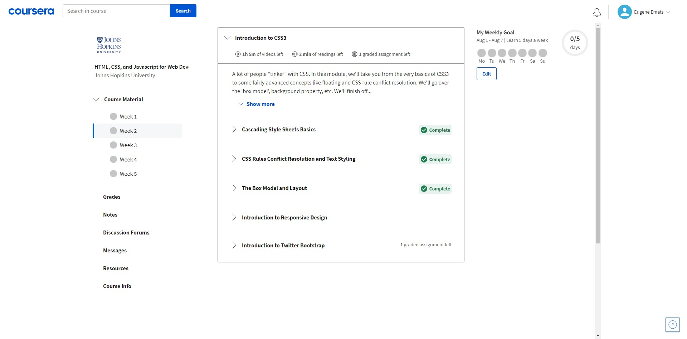
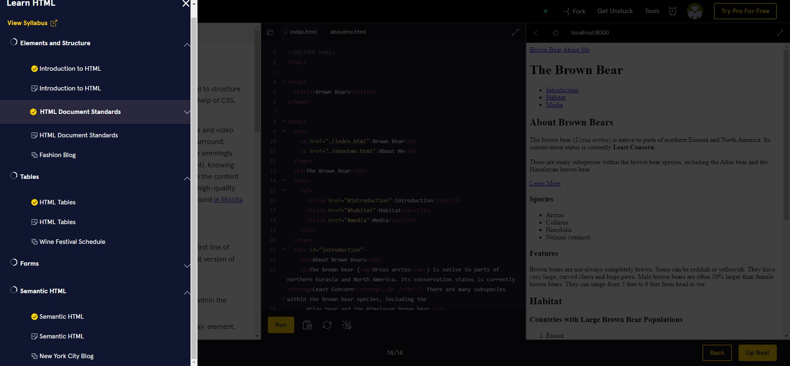
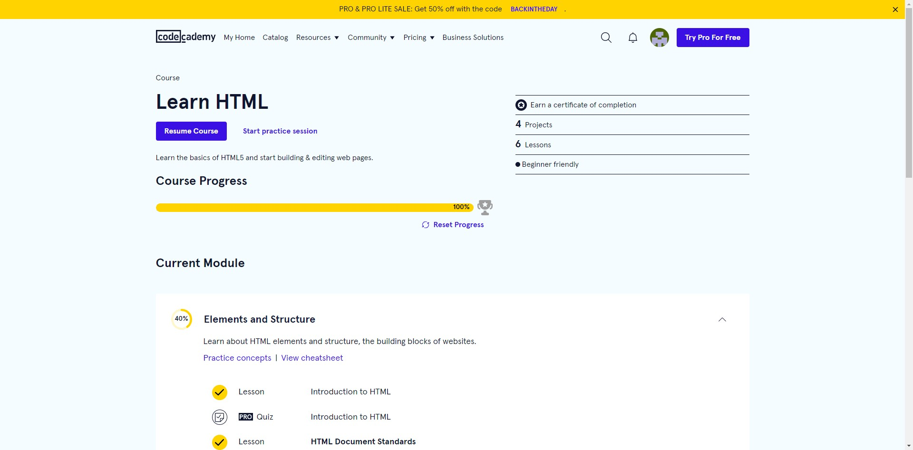
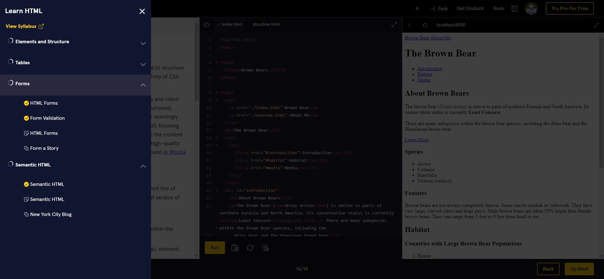
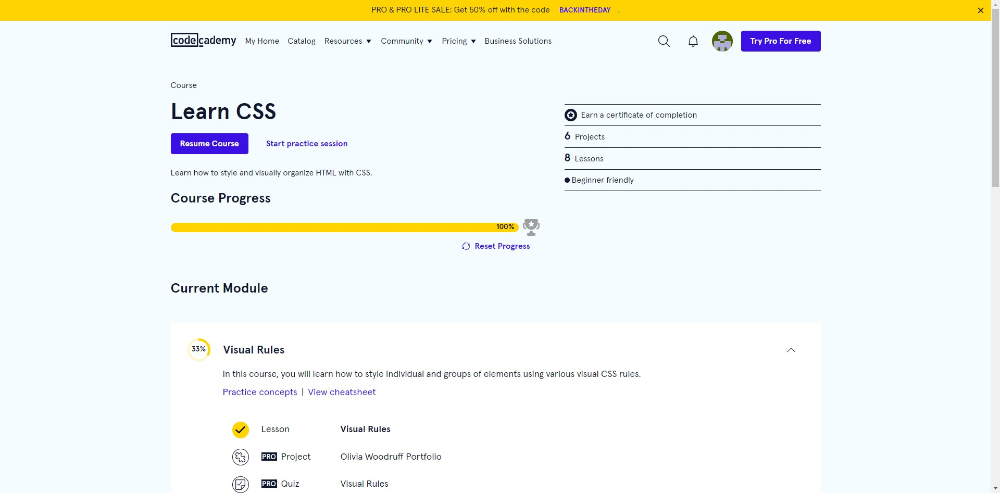

---
## Responsive Web Design

Designing a website for mobile devices is standard nowadays. Therefore, knowledge of responsive web design techniques is very important.

After studying this section, I learn in detail how to properly create sites that display correctly on different devices. First of all, it is media queries, adaptive layouts - Flexbox and Grid. Also, I learn how popular CSS frameworks, like Bootstrap, make their work.

Shortly, I want to pay more attention to the practical application of responsive layouts, especially Grid. At the moment, it is more difficult for me to understand how it works.
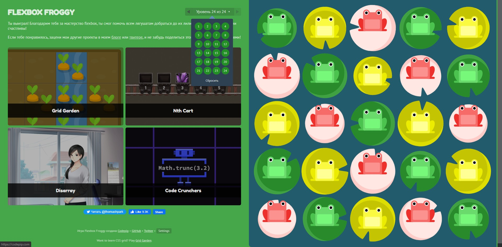
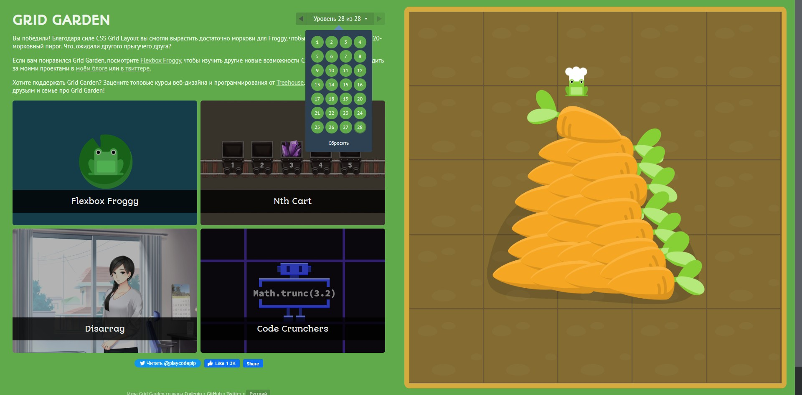

---
## HTML CSS Popup

Practice in HTML And CSS

[Demo](https://expero1.github.io/html-css-popup/)
[Code base](https://github.com/expero1/html-css-popup)

---
## JS Basics

I have already studied the basics of javascript before, I did not learn anything new. Much more interesting is the execution context. I do not fully understand why this in some cases points to the object itself, in which it is applied, and in others to the one in which it is called. I want to study this topic in more detail shortly.

It was interesting to learn the basics of functional programming in javascript, callback functions, and the concept of first-class and higher-order functions.

I also want to understand the concept of closure in javascript and learn more about the features that have been added to ES6.

It takes a lot of practice to fully utilize all the possibilities, which is what I intend to do.

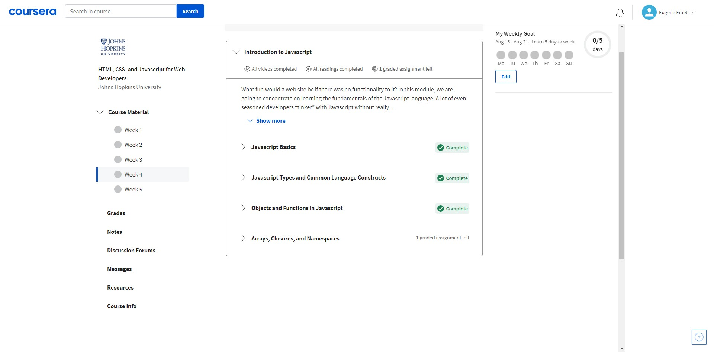
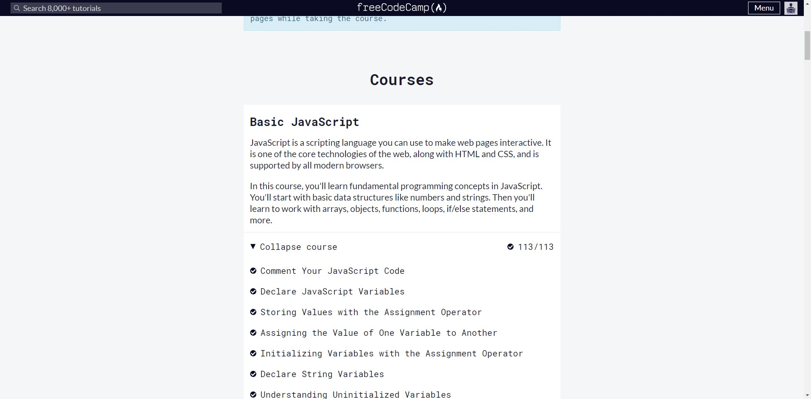
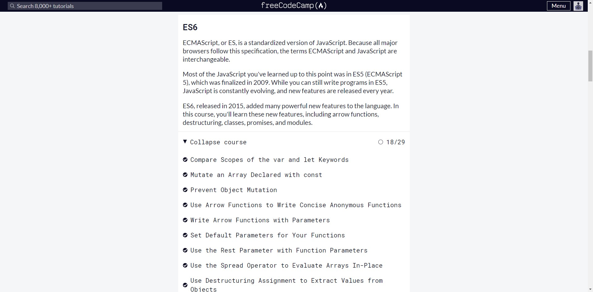
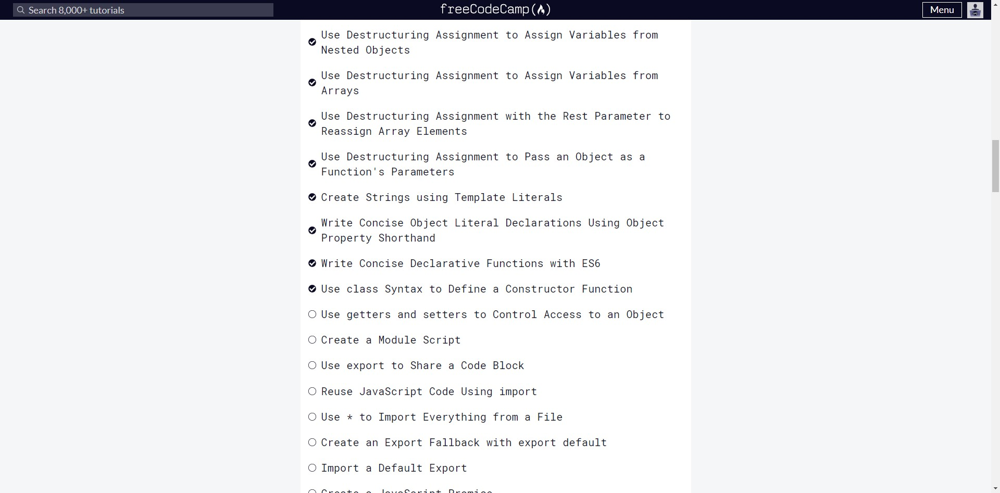
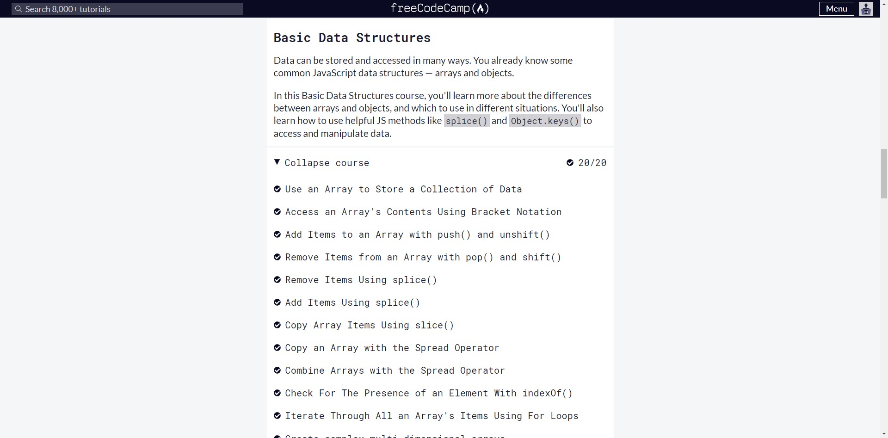
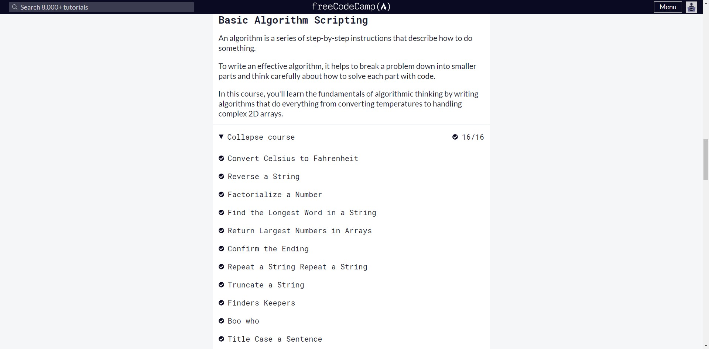
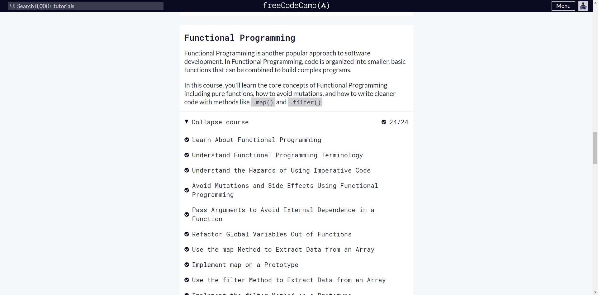

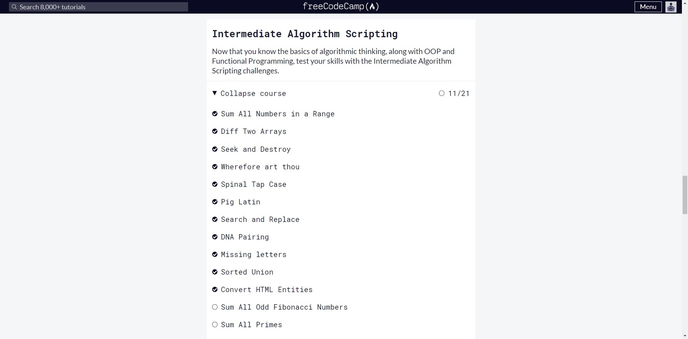

