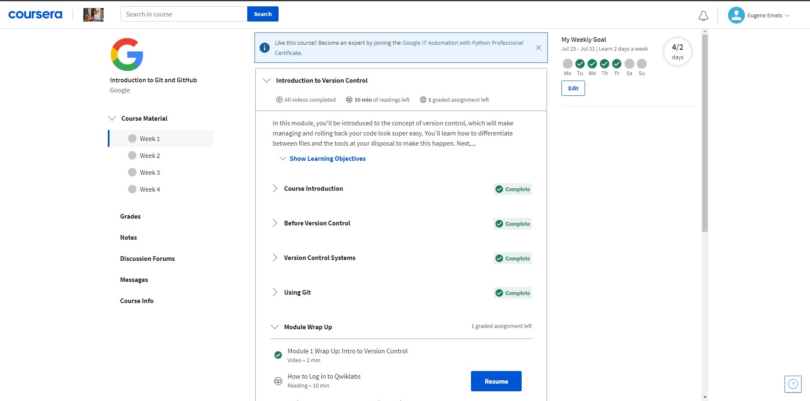
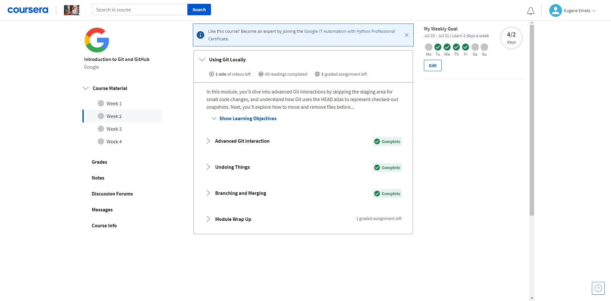
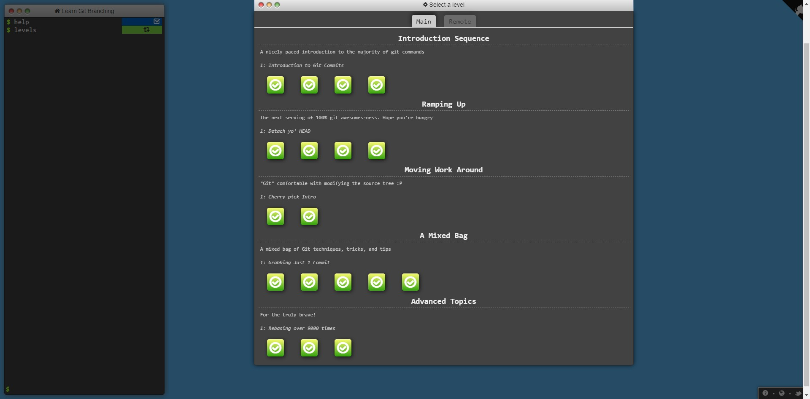
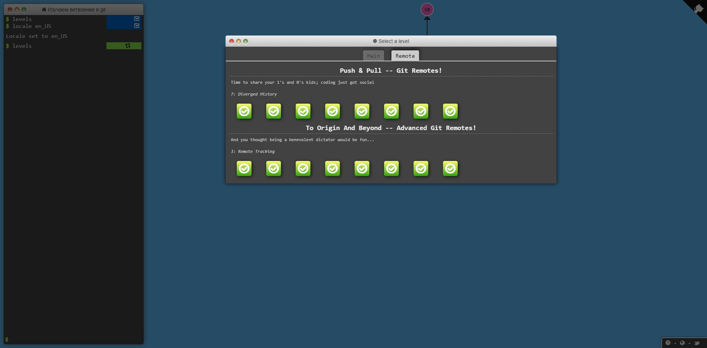

# Kottans frontend course working diary

## Greating

Hi. My name is Eugene. I am interested in web development.
Nowdays I am learning JavaScript, React JS, HTML and CSS.
Also I learn python and SQL for Backend purposes.
And little bit of PHP.
When I read news about opening [Kottans frontend course](https://github.com/kottans/frontend), I wanted to participate this challenge.
And even if I will not go on Stage 1, I will try to finish full course and get new knowledge about web development.

--

## Git Basics

I knew certain basic things about git before. But only now I realized that I knew almost nothing about this instrument. Branching, as well as remote work mechanisms, allow you to work on the project safely and conveniently. And not necessarily even as a team, even when you are the only developer of the project, branching allows you to avoid many problems.

---

- The new things I've covered in detail are branching and collaborating. These are truly powerful tools that unlock the power of git.

- I was surprised that git is based on fairly simple principles, it is a completely open tool, on the one hand simple, but on the other hand very powerful and fast, one of the most important tools for modern software development

- Until recently, I tried to use git several times. But since I did not fully understand the principle of its use, the interaction did not continue beyond the first steps. Now I want to try to use branching in my projects when developing new functions in own projects. The most important thing is practice to get used to the commands and the logic of building the commit tree. I even write this part of the file in a separate branch, so that later I can merge it into the main branch.

---

### Useful links about git

[Learn Git Branching](https://learngitbranching.js.org/)
I found this link on Kottans course. This is a useful resource for understanding complex git concepts. It seems to me that in real projects such complex branching is unlikely to occur :)

[Git HowTo](https://githowto.com/)
A good tutorial that shows all the basic concepts of Git step by step on a small project. I like this site.

 

